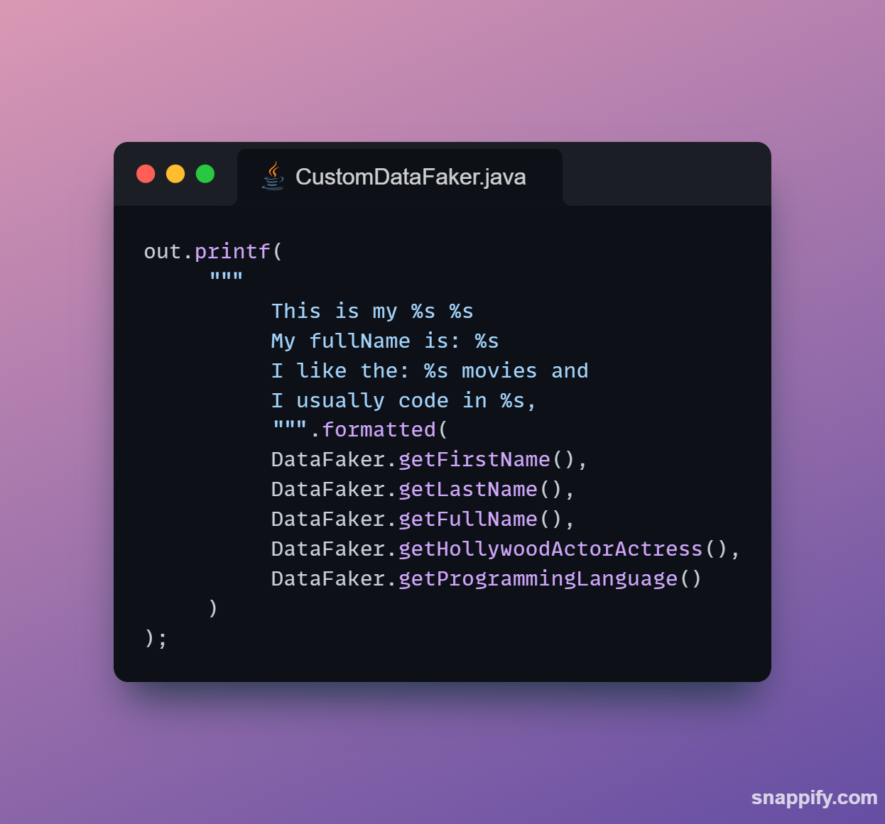

## CustomDataFaker
* CustomDataFaker is a versatile Java class designed to generate synthetic data for various use cases, including 
  testing, sample data generation, and prototyping. 
* This utility provides a wide range of data categories, from names and addresses to programming languages and more, making it a valuable tool for data-driven development.

### Table of Contents

- [Features](#features)
- [Usage](#usage)
- [Data Categories](#data-categories)
- [Example Usage](#example-usage)
- [Output Example](#output-example)
- [Contributing](#contributing)
- [License](#license)

### Features

- **Data Diversity**: 
  - Offers an extensive collection of data categories to suit your needs. Whether you require random names, addresses, or even superhero names, it has you covered.

- **Easy Integration**: 
  - Integrating CustomDataFaker into your Java project is straightforward. 
  - Simply import the `CustomDataFaker` class and start generating data with minimal setup.

- **Customization**:
  - Feel free to extend or modify the data categories within the class to align with your specific
    requirements.

### Usage

To use CustomDataFaker in your Java project, follow these steps:
1. Clone or download the CustomDataFaker repository.
2. Import the `CustomDataFaker` class into your Java project.
3. Use the provided methods to generate random data as needed in your application.

### Data Categories
CustomDataFaker can generate data in the following categories:
- **Addresses**: Generate random street addresses.
- **Animals**: Get names of various animals.
- **Hollywood Actors/Actresses**: Retrieve the names of famous actors and actresses.
- **Barcodes**: Generate barcode numbers.
- **Beers**: Get the names of different types of beer.
- **Books**: Fetch the titles of classic books.
- **Cat Breeds**: Access names of popular cat breeds.
- **Dog Breeds**: Obtain names of well-known dog breeds.
- **Currencies**: Retrieve currency codes (e.g., USD, EUR).
- **Dates**: Generate fixed date values (e.g., 2023-08-28).
- **Diseases**: Get names of common diseases.
- **Sports**: Retrieve names of various sports.
- **Genders**: Generate random gender options.
- **Hobbies**: Get hobby names for diverse interests.
- **Music Genres**: Retrieve music genre names.
- **Nations**: Access names of countries.
- **Numbers**: Get numbers in word format (e.g., "One," "Two").
- **Phone Numbers**: Generate random phone numbers.
- **Superheroes**: Retrieve names of popular superheroes.
- **Teams**: Get creative team names.
- **Weather Conditions**: Access weather condition descriptions.
- **Universities**: Retrieve names of renowned universities.
- **Businesses**: Get names of well-known companies.
- **Postal Codes**: Generate postal codes.
- **Jobs**: Access various job titles.

You can easily extend this class to include additional data categories or modify existing ones according to your needs.

### Example Usage

Here's a simple example of how to use `CustomDataFaker`:
```java
public class ExampleUsage {

  public static void main(String[] args) {
    System.out.println("Generated Data:");

    // Generate a random first name
    String firstName = CustomDataFaker.getFirstName();
    System.out.println("First Name: " + firstName);

    // Generate a random last name
    String lastName = CustomDataFaker.getLastName();
    System.out.println("Last Name: " + lastName);

    // Generate a random full name
    String fullName = CustomDataFaker.getFullName();
    System.out.println("Full Name: " + fullName);

    // Generate a random programming language
    String programmingLanguage = CustomDataFaker.getProgrammingLanguage();
    System.out.println("Programming Language: " + programmingLanguage);

    // Add more data generation as needed...
  }
} 
```
### Output Example
